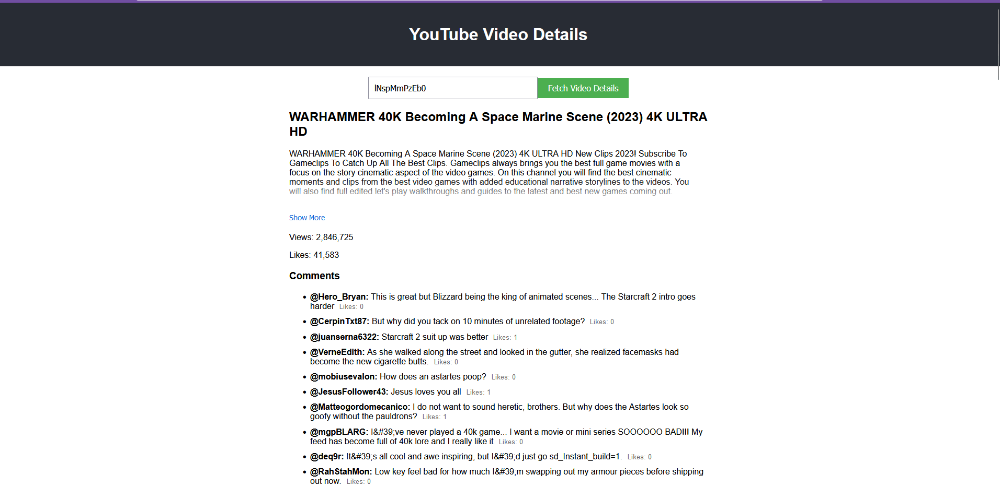

# CodeMatic | YouTube Video Details App

This project is a simple frontend application that fetches and displays details and comments for YouTube videos using the [Youtube Processor](https://github.com/PamilerinId/codematic-youtube-backennd) which depends on the YouTube Data API.

## Screenshot


## Features

- Fetch video details (title, description, view count, like count) for a given YouTube video ID
- Load and display top-level comments for the video
- Handle API rate limits and errors gracefully
- Responsive user interface built with React and TypeScript

## Prerequisites

Before you begin, ensure you have met the following requirements:

- Node.js (v14 or later)
- npm (v6 or later)
- A YouTube Data API key

## Setup

1. Clone the repository:
   ```
   git clone https://github.com/PamilerinId/codematic-youtube-frontend.git
   cd codematic-youtube-frontend
   ```

2. Clone and run the data processor [here](https://github.com/PamilerinId/codematic-youtube-backennd) first !!!
3. Install dependencies:
   ```
   npm install
   ```

3. Rename the `.env.example` file to `.env` in the root directory and update your base url the API is running on:
   ```
   REACT_APP_API_BASE_URL=your_base_url_here
   ```

## Running the Application

1. Start the development server:
   ```
   npm start
   ```

2. Open [http://localhost:3000](http://localhost:3000) to view it in the browser.